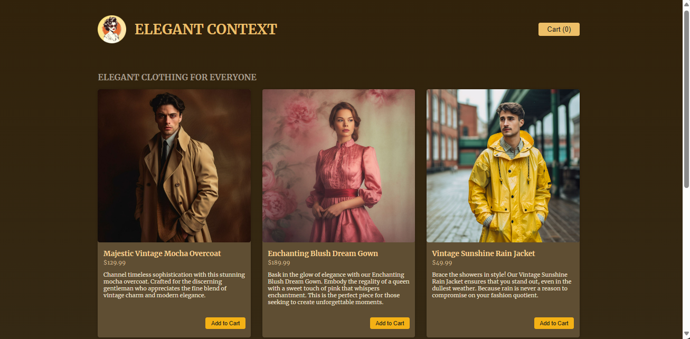
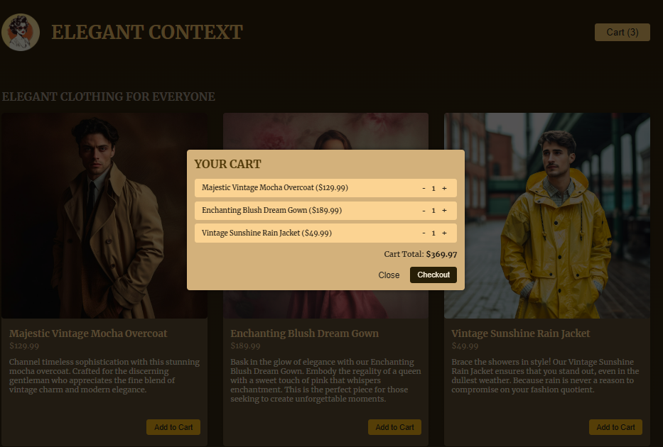

# ELEGANT CONTEXT

The Elegant Clothing Store Landing Page is a simple one-page web application built with React and Tailwind CSS. It provides users with a platform to browse elegant clothes and add them to the cart for ordering.

## Features

- Browse elegant clothing items.
- Add items to the cart.
- View the cart summary.
- Responsive design for mobile and desktop.

## Technologies Used

- React: JavaScript library for building user interfaces.
- Tailwind CSS: Utility-first CSS framework for styling.

## About the Developer

**Name:** Ben Hammouda Mohamed Ali  
**Role:** Full Stack Developer (React/.NET)

### Dashboard:

### YOUR CART:

